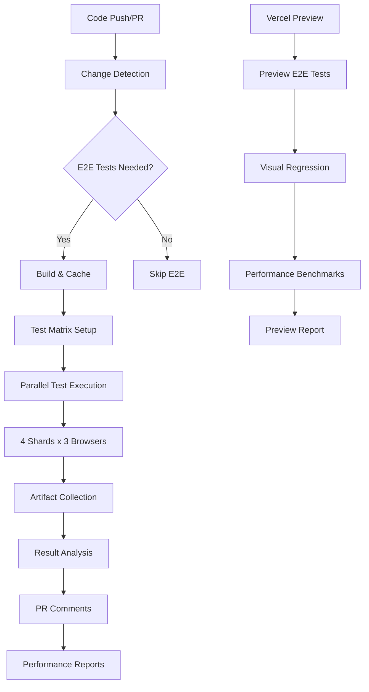

# GitHub Actions E2E Testing Pipeline

A comprehensive, production-ready E2E testing infrastructure for the Promptliano project, built with modern CI/CD best practices and optimized for performance, reliability, and maintainability.

## 🏗️ Architecture Overview



## 📁 Workflow Files

### Core Workflows

- **[`e2e-tests.yml`](./e2e-tests.yml)** - Main E2E testing workflow
- **[`e2e-reusable.yml`](./e2e-reusable.yml)** - Reusable workflow for different environments  
- **[`e2e-vercel-preview.yml`](./e2e-vercel-preview.yml)** - Vercel preview deployment testing
- **[`ci-integration.yml`](./ci-integration.yml)** - Main CI pipeline integration
- **[`performance-benchmarks.yml`](./performance-benchmarks.yml)** - Performance monitoring

## 🚀 Key Features

### ⚡ Performance Optimizations

- **Bun Runtime**: 4x faster dependency installation vs npm/yarn
- **Intelligent Caching**: Multi-layer caching for Bun dependencies, Playwright browsers, and build artifacts
- **Test Sharding**: Parallel execution across 4 shards for faster feedback
- **Smart Browser Installation**: Only installs required browsers per matrix job
- **Optimized Runners**: Ubuntu-latest with performance tuning

### 🧪 Test Strategy

- **Matrix Testing**: Chrome, Firefox, Mobile Chrome, Mobile Safari
- **Test Suites**: Smoke, Critical, Full test configurations
- **Environment Support**: Development, Staging, Production, Preview
- **Regression Detection**: 5% threshold with configurable alerts

### 🔒 Security & Reliability

- **Least Privilege**: Minimal required permissions
- **Pinned Actions**: SHA-pinned for supply chain security
- **Test Isolation**: Independent databases per shard
- **Retry Logic**: 1-2 retries for flaky test resilience
- **Timeout Management**: Appropriate timeouts at all levels

### 📊 Reporting & Insights

- **Rich PR Comments**: Automated test result summaries
- **Performance Tracking**: Lighthouse metrics and regression detection
- **Visual Reports**: Screenshot/video capture on failures
- **Artifact Management**: Organized test artifacts with retention policies

## 🎯 Usage

### Automatic Triggers

```yaml
# Automatically runs on:
- Pull requests to main/architecture-revamp
- Pushes to main branches
- File changes in packages/client, packages/server, etc.
- Vercel preview deployments
```

### Manual Execution

```bash
# Trigger via GitHub UI workflow dispatch with options:
- Test Suite: smoke | critical | full | custom
- Browsers: chromium,firefox,webkit,mobile-chrome
- Shards: 1-8 (default: 4)
- Environment: development | staging | production
```

### Test Labels

Add labels to PRs for enhanced testing:

- `e2e-test` - Runs comprehensive E2E suite
- `performance` - Includes performance benchmarks
- `visual-regression` - Enables visual diff testing

## 🛠️ Configuration

### Environment Variables

```yaml
# Performance Settings
BUN_VERSION: "1.1.34"
PLAYWRIGHT_BROWSERS_PATH: ~/.cache/playwright
MAX_OLD_SPACE_SIZE: 4096
UV_THREADPOOL_SIZE: 128

# Test Configuration
CI: true
NODE_ENV: test
FORCE_COLOR: 1
```

### Secrets Required

```yaml
# For Vercel Integration
VERCEL_TOKEN: <vercel-api-token>
VERCEL_ORG_ID: <vercel-org-id>
VERCEL_PROJECT_ID: <vercel-project-id>

# For Notifications (Optional)
SLACK_WEBHOOK_URL: <slack-webhook>
```

## 📈 Performance Benchmarks

### Frontend Metrics Tracked

- **Performance Score**: Lighthouse overall score
- **First Contentful Paint**: Time to first content render
- **Largest Contentful Paint**: Time to main content render
- **Cumulative Layout Shift**: Visual stability metric
- **Time to Interactive**: Full interactivity timeline
- **Bundle Size**: JavaScript/CSS payload analysis

### Backend Metrics Tracked

- **API Response Times**: Average, min, max per endpoint
- **Requests Per Second**: Throughput measurements
- **Success Rates**: Error rate tracking
- **Database Performance**: Query execution times
- **Memory Usage**: Runtime memory consumption

### Regression Thresholds

```yaml
Performance Regression Alerts:
- Response Time: >5% increase
- Bundle Size: >10% increase
- Performance Score: <5 point decrease
- Memory Usage: >20% increase
```

## 🎨 Test Sharding Strategy

### 4-Shard Configuration

```yaml
Shard Distribution:
- Shard 1/4: Core navigation, authentication
- Shard 2/4: Project management, file operations  
- Shard 3/4: Chat functionality, AI features
- Shard 4/4: Settings, advanced features, edge cases
```

### Browser Matrix

```yaml
Production Testing:
- Chromium: Desktop Chrome simulation
- Firefox: Cross-browser compatibility
- Mobile Chrome: Mobile responsiveness
- Mobile Safari: iOS compatibility

Development Testing:
- Chromium only (faster feedback)
```

## 📦 Artifact Management

### Generated Artifacts

- **Test Results**: JSON reports, HTML dashboards
- **Screenshots**: Failure screenshots, visual diffs
- **Videos**: Test execution recordings
- **Performance Data**: Lighthouse reports, API benchmarks
- **Coverage Reports**: Code coverage analysis

### Retention Policies

```yaml
Retention Periods:
- PR Test Results: 7 days
- Main Branch Results: 14 days
- Performance Data: 90 days
- Visual Regression: 30 days
```

## 🔧 Local Development

### Prerequisites

```bash
# Install Bun
curl -fsSL https://bun.sh/install | bash

# Install Playwright
cd packages/client
bun install
bunx playwright install
```

### Running Tests Locally

```bash
# Quick smoke tests
bun run test:e2e:fast

# Specific browser
bun run test:e2e:chromium

# With UI mode
bun run test:e2e:ui

# Debug mode
bun run test:e2e:debug
```

### Environment Setup

```bash
# Start development servers
bun run dev:server  # Backend on :3147
bun run dev:client  # Frontend on :1420

# Or use the integrated dev script
bun run dev  # Starts both services
```

## 🐛 Debugging

### Common Issues

**Playwright Browser Not Found**
```bash
cd packages/client
bunx playwright install chromium
```

**Database Connection Issues**
```bash
cd packages/database
bun run migrate  # Reset database
```

**Port Conflicts**
```bash
# Check for running services
lsof -i :1420  # Client port
lsof -i :3147  # Server port
```

### Debug Configuration

```yaml
# Enable debug logging
DEBUG: pw:*
PLAYWRIGHT_DEBUG: 1

# Keep browser open
HEADED: true
SLOW_MO: 1000
```

## 📊 Monitoring & Alerts

### Success Metrics

- **Test Pass Rate**: >95% target
- **Execution Time**: <30 minutes total
- **Flaky Test Rate**: <5%
- **Performance Regression Rate**: <1%

### Alert Conditions

```yaml
Critical Alerts:
- Test failures on main branch
- >10% performance regression
- >50% test execution time increase
- Deployment blocking failures

Warning Alerts:
- Flaky test detection
- 5-10% performance regression
- Test execution time increase
```

## 🔄 Continuous Improvement

### Monthly Reviews

- Analyze flaky test patterns
- Review performance trends
- Update browser support matrix
- Optimize test execution times

### Quarterly Updates

- Upgrade Playwright version
- Review and update test strategies
- Benchmark against industry standards
- Security audit of workflows

## 🤝 Contributing

### Adding New Tests

1. **Follow Patterns**: Use existing page objects and utilities
2. **Test Isolation**: Ensure tests don't depend on each other
3. **Performance**: Keep tests fast and focused
4. **Documentation**: Update test documentation

### Workflow Modifications

1. **Test Changes**: Validate workflow changes in feature branches
2. **Security**: Maintain least-privilege permissions
3. **Performance**: Monitor impact on CI execution time
4. **Documentation**: Update this README for significant changes

## 📚 Resources

### Documentation

- [Playwright Testing Guide](https://playwright.dev/docs/intro)
- [Bun Performance Optimization](https://bun.sh/docs/runtime/performance)
- [GitHub Actions Best Practices](https://docs.github.com/en/actions/learn-github-actions/security-hardening-for-github-actions)

### Internal Links

- [E2E Test Documentation](../packages/client/e2e/docs/)
- [Test Data Management](../packages/client/e2e/fixtures/)
- [Page Object Patterns](../packages/client/e2e/pages/)

---

## 📄 License

This E2E testing infrastructure is part of the Promptliano project and follows the same license terms.

**Built with 💪 by the Promptliano Team**

*Optimized for performance, built for reliability, designed for scale.*