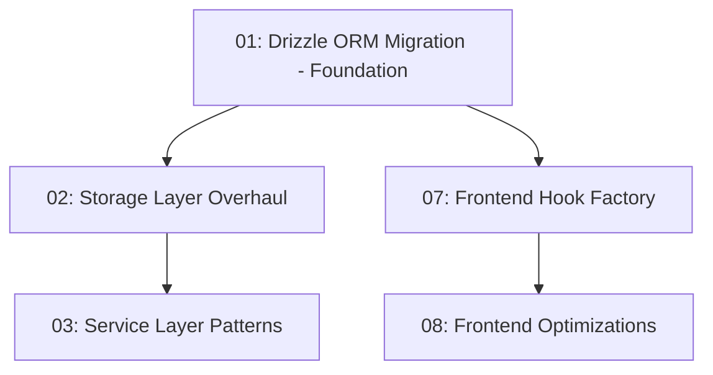
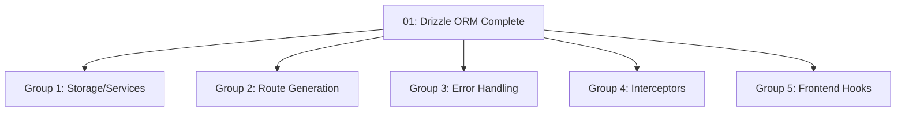

# Architecture Improvements - Dependency Graph

## Overview
This document maps the dependencies between all architecture improvements, identifying what must be done sequentially and what can be done in parallel.

## Critical Path (Sequential - MUST be in order)

## Parallel Work Opportunities

### After Drizzle ORM is complete, these can be done in parallel:

## Detailed Dependencies

### 🔴 CRITICAL - Must Be First
**01-drizzle-orm-migration.md**
- **Dependencies:** None (Foundation)
- **Blocks:** Everything else
- **Why:** Becomes the single source of truth for all schemas
- **Estimated Time:** 1-2 weeks
- **Team Size:** 1-2 developers

### 🟡 Backend Core (Depends on Drizzle)

**02-storage-layer-overhaul.md**
- **Dependencies:** 01 (Drizzle ORM)
- **Blocks:** 03 (Service Layer)
- **Can parallel with:** 04, 05, 06, 07
- **Estimated Time:** 2-3 weeks
- **Team Size:** 2-3 developers

**03-service-layer-patterns.md**
- **Dependencies:** 01, 02 (Drizzle + Storage)
- **Blocks:** API consumption
- **Can parallel with:** 04, 05, 06
- **Estimated Time:** 2 weeks
- **Team Size:** 2 developers

### 🟢 Parallel Backend (Can start after Drizzle)

**04-route-generation.md**
- **Dependencies:** 01 (Drizzle schemas)
- **Blocks:** None
- **Can parallel with:** 02, 05, 06, 07
- **Estimated Time:** 1 week
- **Team Size:** 1 developer

**05-error-factory.md**
- **Dependencies:** None (but better with 01)
- **Blocks:** None
- **Can parallel with:** All others
- **Estimated Time:** 3-4 days
- **Team Size:** 1 developer

**06-interceptors.md**
- **Dependencies:** None
- **Blocks:** None
- **Can parallel with:** All others
- **Estimated Time:** 3-4 days
- **Team Size:** 1 developer

### 🔵 Frontend (Depends on Backend schemas)

**07-frontend-hook-factory.md**
- **Dependencies:** 01 (Drizzle schemas)
- **Blocks:** 08 (Frontend optimizations)
- **Can parallel with:** 02, 03, 04, 05, 06
- **Estimated Time:** 2-3 weeks
- **Team Size:** 2-3 developers

**08-frontend-optimizations.md**
- **Dependencies:** 07 (Hook Factory)
- **Blocks:** None
- **Can parallel with:** Late-stage backend work
- **Estimated Time:** 1-2 weeks
- **Team Size:** 2 developers

## Optimal Team Distribution

### Sprint 1-2: Foundation (Weeks 1-2)
- **Team A (2 devs):** 01-drizzle-orm-migration.md

### Sprint 3-4: Parallel Execution (Weeks 3-4)
- **Team A (3 devs):** 02-storage-layer-overhaul.md
- **Team B (2 devs):** 07-frontend-hook-factory.md (start)
- **Team C (1 dev):** 04-route-generation.md
- **Team D (1 dev):** 05-error-factory.md + 06-interceptors.md

### Sprint 5-6: Integration (Weeks 5-6)
- **Team A (2 devs):** 03-service-layer-patterns.md
- **Team B (3 devs):** 07-frontend-hook-factory.md (complete)
- **Team C+D (2 devs):** Integration and testing

### Sprint 7-8: Optimization (Weeks 7-8)
- **Team B (2 devs):** 08-frontend-optimizations.md
- **All teams:** Migration, testing, and refinement

## Risk Mitigation

### High-Risk Dependencies
1. **Drizzle ORM Migration** - Everything depends on this
   - Mitigation: Start immediately, allocate best developers
   - Have rollback plan ready

2. **Storage Layer** - Services depend on this
   - Mitigation: Can start design while Drizzle is in progress
   - Create interfaces early

### Low-Risk Parallel Work
- Error Factory and Interceptors have no dependencies
- Can be developed and tested independently
- Can be integrated last without blocking other work

## Success Criteria

Each improvement is complete when:
1. ✅ All code is migrated to new patterns
2. ✅ Tests are passing with new implementation
3. ✅ Documentation is updated
4. ✅ No regressions in functionality
5. ✅ Performance metrics meet or exceed targets

## Quick Reference Matrix

| File | Depends On | Blocks | Can Parallel With | Priority |
|------|------------|--------|-------------------|----------|
| 01-drizzle | None | All | None | 🔴 CRITICAL |
| 02-storage | 01 | 03 | 04,05,06,07 | 🟡 HIGH |
| 03-service | 01,02 | None | 04,05,06,08 | 🟡 HIGH |
| 04-routes | 01 | None | 02,03,05,06,07 | 🟢 MEDIUM |
| 05-errors | None | None | All | 🟢 MEDIUM |
| 06-interceptors | None | None | All | 🟢 MEDIUM |
| 07-hooks | 01 | 08 | 02,03,04,05,06 | 🔵 HIGH |
| 08-frontend-opt | 07 | None | 03,04,05,06 | 🔵 MEDIUM |

## Recommended Reading Order

For understanding the full picture:
1. Read this dependencies file first
2. Read 01-drizzle-orm-migration.md (foundation)
3. Read 09-implementation-roadmap.md (timeline)
4. Then read specific improvements based on your team assignment