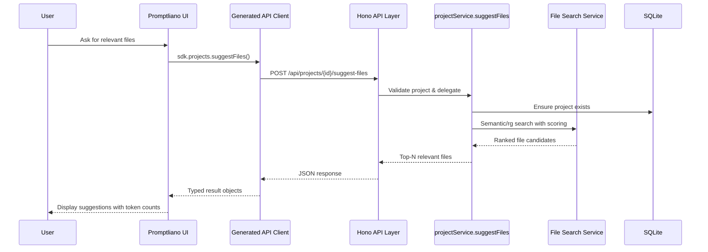
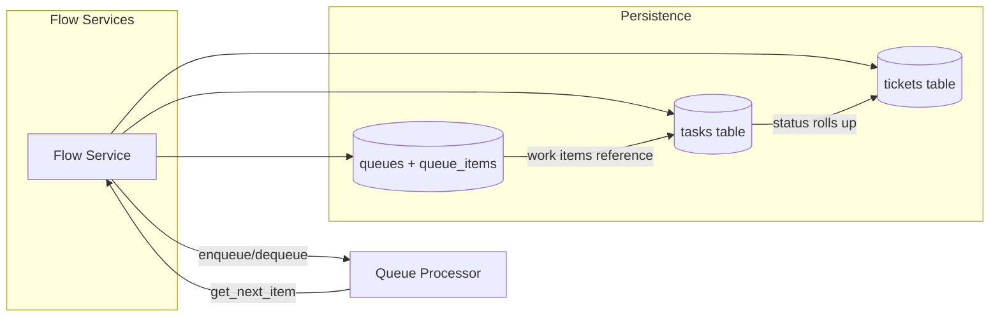

# Promptliano Architecture Overview

This document summarizes the major building blocks that power Promptliano, highlights how requests flow across the stack, and captures the relationships inside the Flow (tickets/tasks/queues) domain.

## Core Packages & Responsibilities

- `packages/server` — Bun + Hono HTTP/MCP server that exposes REST APIs, OpenAPI docs, and the consolidated MCP tool surface.
- `packages/services` — Domain services composing repository access, file search engines, AI integrations, and flow orchestration logic.
- `packages/database` — Drizzle ORM schemas, migrations, and repository layer targeting the project-scoped SQLite database.
- `packages/client` — React/TanStack Router UI that talks to the API through the generated Promptliano client and manages local workspace state.
- `packages/api-client` — OpenAPI-derived TypeScript SDK used by both the web UI and external consumers for strongly typed HTTP access.
- `packages/promptliano` — CLI installer/manager that bootstraps the server, configures editors, and maintains local binaries.
- `packages/mcp-client` & `packages/ui` — Reusable MCP client helpers and shared UI primitives consumed by the app and website bundles.
- `packages/copilot-api` — Optional OpenAI-compatible proxy for GitHub Copilot traffic routed through the main server.

## High-Level Architecture

```mermaid
graph TD
  subgraph Clients
    UI[React UI (packages/client)]
    CLI[Promptliano CLI (packages/promptliano)]
    Editors[MCP-Compatible Editors]
  end

  subgraph Server
    API[Hono/Bun API Server]
    MCP[Model Context Protocol Server]
    Services[Domain Services Layer]
    Search[File Search Backends\n(sg • rg • fts • like)]
  end

  subgraph Data & Providers
    DB[(SQLite via Drizzle ORM)]
    AI[External AI Providers\n(OpenAI, Anthropic, etc.)]
    Copilot[Copilot Proxy]
  end

  UI -->|REST / SSE| API
  CLI -->|Server lifecycle & config| API
  Editors -->|tools/call| MCP
  MCP --> Services
  API --> Services
  Services --> DB
  Services --> Search
  Services --> AI
  Services --> Copilot
```

## Request Lifecycle Example — File Suggestions



## Flow Domain Relationships



## Data & Infrastructure Notes

- Default storage is a project-local SQLite database under `./data/promptliano.db`; paths can be overridden with `DATABASE_PATH` or `PROMPTLIANO_DATA_DIR`.
- File search delegates to runtime-selected engines (ast-grep, ripgrep, SQLite FTS, or SQL LIKE) with smart fallbacks configured via env.
- OpenAPI docs are generated directly from the route registrations (`/swagger` UI, `/doc` JSON) with zod-openapi schemas sourced from `@promptliano/schemas`.

## MCP Integration Snapshot

- The MCP server (`packages/server/src/mcp/server.ts`) exposes consolidated tools (project, prompt, git, flow, ai assistant) and resources derived from the same service layer as the HTTP API.
- `PROMPTLIANO_PROJECT_ID` scopes MCP tool calls to a project; arguments missing `projectId` inherit the scoped value automatically.
- MCP resources mirror key REST surfaces (file trees, project overviews) so editors can navigate context without leaving their IDE.

## Development Workflow Highlights

- `bun run dev` launches the full stack (API server, React client, MCP inspector) with hot reloading.
- Tests are split between Bun unit suites (`bun run test`), Playwright E2E flows in the client package, and API contract tests in `packages/api-client`.
- Before releasing, run `bun run validate` for combined type checks and tests, then `bun run build-binaries` to emit platform-specific executables in `dist/`.
