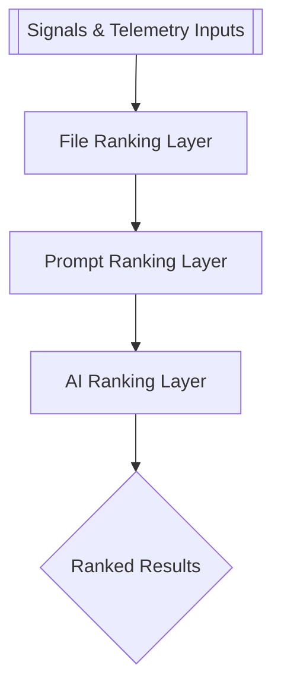
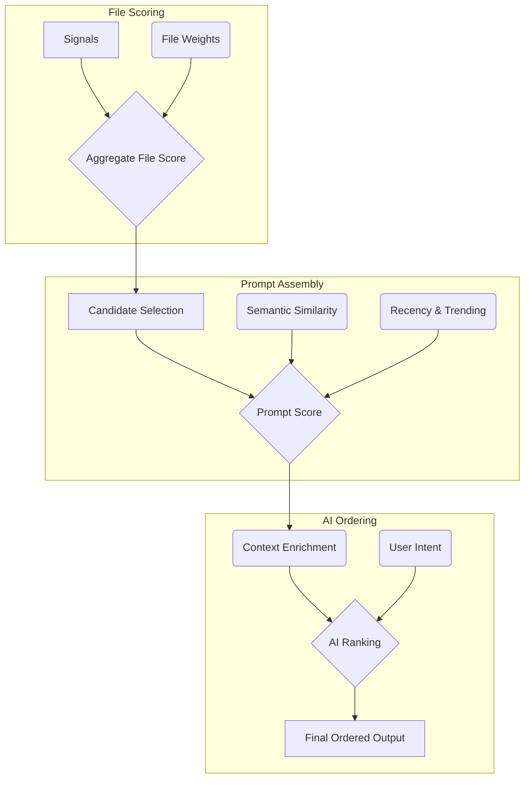

# Ranking Stack Overview

This guide explains how ranking signals stack from the lowest file-level inputs to the AI-powered aggregation that surfaces results to users. The stack operates bottom-up: raw signals produce file rankings, which inform prompt-level scoring, and the AI layer orchestrates the final ordering presented in the UI.

## Layered Perspective

- **Signals**: Telemetry such as file metadata, usage frequency, and search heuristics. These are the raw ingredients.
- **File Ranking**: Scores individual files using the raw signals. Results include rank positions and confidence ranges.
- **Prompt Ranking**: Consolidates relevant files into prompt candidates. Applies additional weights (freshness, semantic similarity) to craft per-prompt scores.
- **AI Ranking**: Consumes prompt candidates and contextual data, then produces the final ordered list shown to the user.

## Bottom-Up Data Flow

The process is iterative. Each layer refines what it receives from the layer beneath it and adds metadata that the next layer can leverage. The old Mermaid syntax below illustrates how scoring attributes move upward until the AI layer synthesizes the final answer list.

## Notes for Contributors

- Treat ranking weights as configurable inputs. The AI layer expects normalized scores; keep ranges consistent.
- When adding new signals, document whether they operate at the file or prompt layer and how they should be normalized.
- The AI layer can be retrained independently. Update the prompt ranking schema when introducing new features so the AI layer contracts remain stable.
