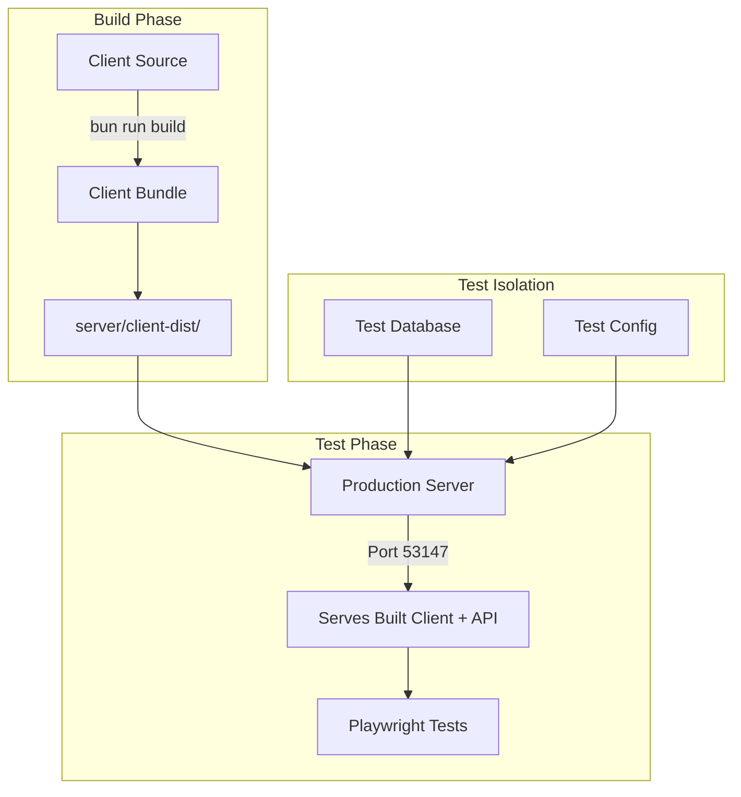

# Promptliano E2E Build & Test Workflow

## Overview

This document describes the comprehensive E2E testing workflow for Promptliano, focusing on testing against production builds to ensure deployment readiness.

## Architecture

### Components



### Key Files

- **Build Script**: `e2e/scripts/build-and-test.ts` - Orchestrates the entire workflow
- **Server Manager**: `e2e/utils/server-manager.ts` - Manages server processes
- **Production Config**: `playwright-production.config.ts` - Playwright configuration for production testing
- **Global Setup**: `e2e/setup/global-setup-production.ts` - Test environment initialization

## Workflow Sequences

### 1. Development Testing Workflow

```bash
# Quick iteration with dev server (default)
bun run test:e2e

# Test against production build
bun run test:e2e:production

# Debug production tests with browser UI
bun run test:e2e:production:headed

# Run specific test suite
bun run test:e2e:production --grep smoke
```

### 2. CI/CD Workflow

```yaml
# GitHub Actions workflow sequence
1. Checkout code
2. Install dependencies
3. Build client once (cached)
4. Start server with built client
5. Run Playwright tests (sharded)
6. Aggregate results
7. Cleanup
```

### 3. Local Production Testing

```bash
# Full production test cycle
cd packages/client
bun run e2e/scripts/build-and-test.ts

# Skip build if already built
bun run e2e/scripts/build-and-test.ts --skip-build

# Debug mode with browser
bun run e2e/scripts/build-and-test.ts --headed --debug
```

## Port Management

### Default Port Allocation

| Service | Port | Description |
|---------|------|-------------|
| Production Server | 53147 | Serves built client + API |
| Dev Client | 51420 | Vite dev server |
| Dev API | 53147 | API server (development) |
| CI Shard N | 53147+N | Isolated port per test shard |

### Dynamic Port Assignment (CI)

```typescript
// Each CI shard gets unique ports
const port = 53147 + shardIndex
const clientPort = 51420 + shardIndex
```

## Build Process

### Client Build Steps

1. **TypeScript Compilation**
   ```bash
   tsc -b tsconfig.app.json
   ```

2. **Vite Build**
   ```bash
   vite build
   ```

3. **Output Structure**
   ```
   packages/server/client-dist/
   ├── index.html
   ├── assets/
   │   ├── index-[hash].js
   │   ├── index-[hash].css
   │   └── vendor-[hash].js
   └── favicon.ico
   ```

### Build Verification

The server manager automatically verifies:
- Build output exists at `server/client-dist/index.html`
- All required assets are present
- Server can serve static files correctly

## Server Configuration

### Environment Variables

```bash
# Production Testing
NODE_ENV=production      # Production mode
PORT=53147               # Server port
DATABASE_PATH=test.db    # Test database
SERVE_CLIENT=true        # Serve built client
LOG_LEVEL=error         # Minimal logging

# Development Testing
NODE_ENV=e2e            # E2E test mode
VITE_API_URL=...        # API endpoint for client
```

### Server Startup Sequence

1. Check for client build in `client-dist/`
2. Initialize test database
3. Start Express/Hono server
4. Mount static file serving for client
5. Start API routes
6. Health check endpoint ready

## Test Execution

### Playwright Configuration

```typescript
// playwright-production.config.ts
export default defineConfig({
  use: {
    baseURL: 'http://localhost:53147',
    // Server serves both client and API
  },
  
  webServer: process.env.EXTERNAL_SERVER ? undefined : [{
    command: 'cd ../server && PORT=53147 ...',
    url: 'http://localhost:53147/api/health',
  }]
})
```

### Test Strategies

#### Smoke Tests
Quick validation of critical paths:
```bash
bun run test:e2e:production --grep smoke
```

#### Full Suite
Comprehensive testing:
```bash
bun run test:e2e:production
```

#### Visual Regression
Screenshot comparison:
```bash
bun run test:e2e:production --update-snapshots
```

## Isolation & Cleanup

### Test Isolation

Each test run uses:
- Isolated test database
- Unique port assignments (CI)
- Fresh server instance
- Clean browser context

### Cleanup Process

1. **Graceful Shutdown**
   - SIGTERM to all processes
   - 5-second grace period
   - SIGKILL if needed

2. **Resource Cleanup**
   - Close database connections
   - Stop server processes
   - Clear temporary files
   - Reset test state

### Error Handling

```typescript
// Automatic cleanup on failure
process.on('exit', () => serverManager.stopAll())
process.on('SIGINT', () => serverManager.stopAll())
process.on('SIGTERM', () => serverManager.stopAll())
```

## Performance Optimizations

### Build Caching

- CI caches built artifacts between shards
- Local development can skip rebuild with `--skip-build`
- Incremental builds for faster iteration

### Parallel Execution

- Tests run in parallel by default
- CI uses matrix strategy for browser/shard combinations
- Worker count optimized per environment

### Resource Management

- Lazy loading of test assets
- Efficient database pooling
- Minimal server logging in tests

## Debugging

### Debug Commands

```bash
# Visual debugging with browser UI
bun run test:e2e:production --headed --debug

# Verbose server output
DEBUG_SERVER=true bun run test:e2e:production

# Specific test file
bun run test:e2e:production --grep "auth.spec.ts"

# Single browser
bun run test:e2e:production --project chromium
```

### Common Issues

#### Build Not Found
```
Error: Client build not found at: .../server/client-dist/index.html
Solution: Run 'bun run build:client' first
```

#### Port Already in Use
```
Error: Port 53147 is already in use
Solution: Kill existing process or use different port
```

#### Server Timeout
```
Error: Server did not become ready within 60000ms
Solution: Check server logs, increase timeout, verify build
```

### Troubleshooting Steps

1. **Verify Build**
   ```bash
   ls -la packages/server/client-dist/
   ```

2. **Check Server Health**
   ```bash
   curl http://localhost:53147/api/health
   ```

3. **View Server Logs**
   ```bash
   DEBUG_SERVER=true bun run test:e2e:production
   ```

4. **Test Specific Browser**
   ```bash
   bun run test:e2e:production --project chromium
   ```

## CI/CD Integration

### GitHub Actions Setup

```yaml
- name: Build Client
  run: bun run build:client
  
- name: Cache Build
  uses: actions/cache@v4
  with:
    path: packages/server/client-dist
    key: client-build-${{ github.sha }}
    
- name: Run E2E Tests
  run: |
    cd packages/client
    EXTERNAL_SERVER=true bun run test:e2e:production
```

### Environment Detection

The system automatically detects:
- CI environment (`process.env.CI`)
- Available ports
- Build artifacts
- Test environment readiness

## Best Practices

### 1. Always Test Production Builds

```bash
# Before deploying
bun run test:e2e:production
```

### 2. Use Proper Cleanup

```typescript
// In custom test utilities
afterAll(async () => {
  await serverManager.stopAll()
})
```

### 3. Monitor Resource Usage

```bash
# Check for orphaned processes
lsof -i :53147
```

### 4. Validate Static Assets

```typescript
// Test that assets load correctly
await expect(page).toHaveScreenshot('production-app.png')
```

### 5. Test Performance

```typescript
// Measure load times
const metrics = await page.evaluate(() => performance.timing)
expect(metrics.loadEventEnd - metrics.navigationStart).toBeLessThan(3000)
```

## Migration from Dev-Only Testing

### Before (Dev Server Only)
```typescript
// Old approach - only tests dev server
webServer: {
  command: 'bun run dev',
  url: 'http://localhost:5173'
}
```

### After (Production Build Testing)
```typescript
// New approach - tests production build
webServer: {
  command: 'PORT=53147 SERVE_CLIENT=true bun run start',
  url: 'http://localhost:53147'
}
```

### Benefits
- ✅ Catches build-time issues
- ✅ Tests actual production performance
- ✅ Validates asset serving
- ✅ Ensures deployment readiness
- ✅ Tests production error handling

## Future Enhancements

### Planned Improvements

1. **Build Optimization**
   - Incremental builds
   - Build artifact caching
   - Parallel build steps

2. **Test Performance**
   - Smart test selection
   - Dependency-based testing
   - Faster server startup

3. **Monitoring**
   - Performance metrics collection
   - Test flakiness detection
   - Resource usage tracking

4. **Developer Experience**
   - Live test results UI
   - Better error messages
   - Interactive debugging

## Quick Reference

### Essential Commands

```bash
# Build and test (full cycle)
bun run test:e2e:production

# Test with existing build
bun run test:e2e:production:cached

# Debug with browser
bun run test:e2e:production:debug

# Update snapshots
bun run test:e2e:production:update

# CI mode
CI=true bun run test:e2e:production
```

### Script Options

```bash
build-and-test.ts [options]
  --skip-build         # Use existing build
  --headed            # Show browser UI
  --debug             # Pause on first test
  --project <name>    # Specific browser
  --grep <pattern>    # Filter tests
  --workers <n>       # Parallel workers
  --reporter <type>   # Output format
```

### Environment Variables

```bash
# Control behavior
EXTERNAL_SERVER=true    # Server managed externally
DEBUG_SERVER=true       # Verbose server logs
DEBUG_CLIENT=true       # Verbose client logs
CI=true                # CI mode optimizations
```

## Support

For issues or questions:
1. Check this documentation
2. Review error messages carefully
3. Check server logs with `DEBUG_SERVER=true`
4. Consult team in #testing channel
5. File issue with reproduction steps